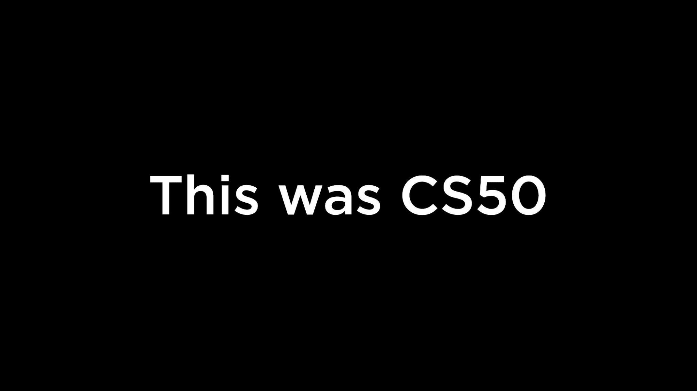
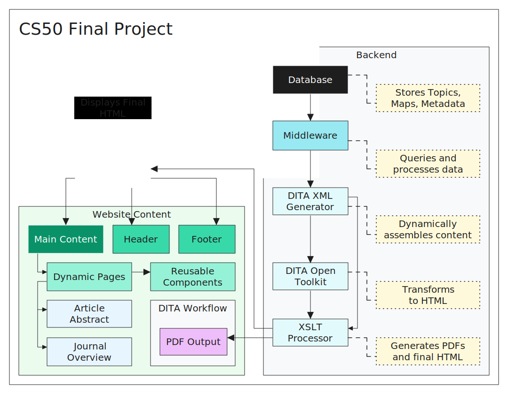
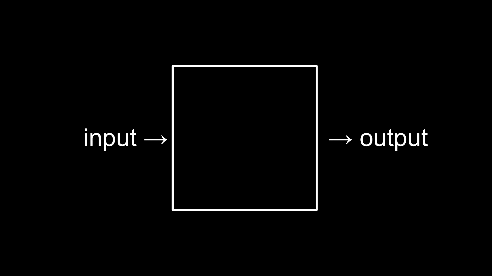
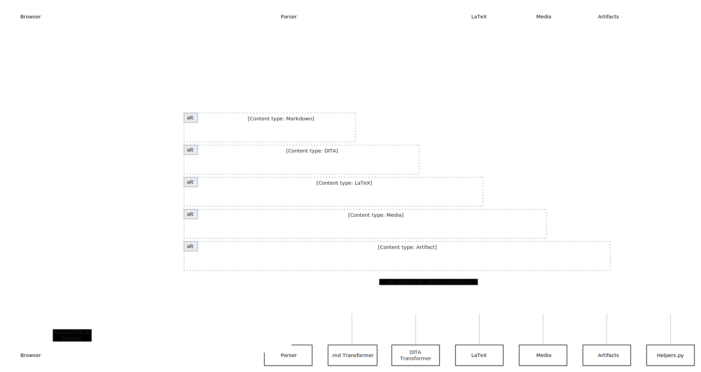

# 1. Introduction

> [!NOTE] Notes
> - You're free to clone this project for your purposes. (Distributed under MIT license.)
> - This project can be deployed with any service that handles dynamic websites
> - This project itself is currently available online at `https://youtu.be/z9EChnu2RhE`
> - You can watch my presentation of all the features on YouTube


## 1.1. Context

- The development of this project is driven by a life-long interest in sharing knowledge. I decided to use my experience as a Technical Writer in conjunction with the new skills I acquired in CS50 to develop a web platform for publishing structured content to the web in the simplest-most concise way.
- The full project consists of a WebApp that serves written materials and different media objects such as images and interactive graphic components. It achieves this by using a robust content strategy built around XML structured content.
- I've used Scientific Publishing as the basis for this project, but the final design should be flexible enough to handle virtually any type of publication and content strategy.
- One of the central aspects of my project is providing authoring flexibility to enhance collaboration without sacrificing the capabilities of structured content. For this reason I devised a workflow that handles  `.dita` and `ditamap`  files along with `.md`. This allows for seamless integration with almost any of today's Content Management System platforms, docs-as-code environments that rely on GitHub/GitLab, and even everyday note-taking apps such as Notion and Obsidian.
- By relying on data-rich structured content platforms, and following content reuse practices, we make tools like search engines and Large-Language Models more effective, enrichening how everyone experiences the web.

# 2. Specifications

## 2.1. Developer tools

This project was developed in [Zed IDE](https://zed.dev/) with assistance of the [Claude 3.5 Sonnet](https://anthropic.com/) large language model from Anthropic Inc., as well as [GitHub](https://github.com/) for version control.

## 2.2. Third-party code and libraries

The main project structure, pipeline design, and processing logic are all original, but they rely on crucial resources such as:
- Python/Flask - Main codebase and scripting language
- SQL - Backend / database
- JavaScript/React - Front-end automation and interactive components
- HTML - Main framework for serving webpages to the browser with Flask
- CSS - Front-end styling
- [Claude 3.5 Sonnet](https://anthropic.com/) - Used to generate sample code for artifacts, articles and general  testing and debugging
- [Bootstrap 5.3.3](https://getbootstrap.com/) - Library for CSS styles and JavaScript components
- [DITA Open Toolkit](https://www.dita-ot.org/) - Main XML/XSLT framework for structured content
- [BeautifulSoup](https://beautiful-soup-4.readthedocs.io/en/latest/) - for parsing XML and HTML
- [Python-Markdown](https://python-markdown.github.io/) - Provides Markdown support
- [LaTeX](https://www.latex-project.org/) - Along with KaTeX provides typesetting and rendering capabilities
- Environment-specific dependencies can be found in `requirements.txt`

## 2.3. Project requirements / Prototype
- This diagram depicts the initial prototype submitted with my project proposal



# 3. Usage
## 3.1. Description

- The main purpose of this WebApp is to make authoring and publishing to the web seamless.
- Once the project is configured and deployed, you can easily publish `.md` and `.dita` files as structured  web content.
- I recommend setting up something like GitHub Actions and Vercel for a smooth continuous deployment pipeline.
- If you opt for this solution, you can use any Markdown based program to author and publish: simply add your local repository folder to the app, and then whenever you make changes to the `.md` files in the `/topics` or `/maps` folders, push the changes to your repo to automatically publish them your website. - I demonstrate this functionality in the accompanying video to this project.
- You can use the templates on the *[[README#5 Content standard]]* section to make your own Topic and Map files. Depending on your authoring tools, you might prefer one or the other. I list the general differences there.
- Once your project is set up, your content file structure should look something like this:
```txt
# EXAMPLE OF A DITA CONTENT DIRECTORY STRUCTURE
├── app
│   ├── dita
│   │   ├── maps # ADD MAPS HERE
│   │   ├── topics # ADD TOPICS HERE
│   │   │   ├── subfolder
│   │   │   │   ├── media # ATTACHMENTS GO HERE
```

- With your folders ready, just finish writing/editing your topics in your favorite authoring tool, set up your article map however you like and... voilà! Visit the entry URL to see your beautifully rendered HTML article page.
- To index and access the articles on the page, the current implementation follows the routing defined in `routes.py`, but more complex indexes can be easily created by leveraging our existing metadata structure. (Or just use sub-directories in the maps folder!)
- If we revisit the framework of `Input -> [_] -> Output`, we can define `input` as the raw content in both **Markdown** and **DITA** file formats that's stored in our content folders; and the `output` as the fully-fledged article entry on our website.



- What goes inside the *black-box*  is the actual implemented version of our workflow as depicted in this UML style sequence diagram:



- A more detailed explanation of what goes behind the scenes can be found in `DESIGN.md`


# 4. Project features

### 4.1. Current features
- Markdown and DITA content serving
- Flexible integration with authoring tools and Content Management Systems solutions
- LaTeX support
- Custom artifacts support
- Multimedia support
- UI tricks
	- Dynamic table of contents integration
	- Condition-based index numbering for headings: no need to manually append indexing numbers to your headings (unless you want to!). Just add the tag `othermeta name="index-numbers"` with the attribute `content="true"` and the processor will keep track of all the headings (H1-H6) and append sequential numbering in order of appearance.
- Continuous deployment support via Vercel and GitHub actions

### 4.2. Planned features
- Support of Page-to-PDF rendering
	- The current implementation can be leveraged to divert processing into a unique transformation pipeline that renders PDFs on demand
	- Current solutions exist to turn HTML into PDF with custom dedicated `.css` files (Pandoc, etc)
	- Complex template-based solutions also exist for serving richer content (InDesign Server, etc)
- A *Read-the-docs* style [flyout menu](https://docs.readthedocs.io/en/stable/flyout-menu.html#custom-event-integration) for:
	- Accessing different versions or revisions of the page
	- Containing options to download/render PDF
	- Language versions
	- Status
	- Citation extraction
	- Links to submit errata
	- Dynamic search
- A comprehensive search engine
- A comprehensive citations processor and a bibliography UI component
- A more robust database design for handling citations and serving conditional and contextual content
- Refined `.md` syntax definitions to include more list formats and custom callouts
- An improved custom front-end built with Figma or similar tools

# 5 . Content standard
- To author and publish in this WebApp environment, it's crucial to understand the way the different files are structured and how to interact with them. In this section we reproduce some of the crucial concepts and syntax used.


## 5.1. Brief introduction to DITA XML
> *Information reproduced directly from the [DITA Style Guide](https://www.oxygenxml.com/dita/styleguide/)  by Oxygen XML*

### 5.1.1. General concepts
- **DITA:** an XML standard, an architectural approach, and a writing methodology, developed by technical communicators for technical communicators.
- **Format, style, data and metadata:** in DITA, format has a different meaning to style. Likewise, the meanings of data and metadata are very different. These distinctions in meaning are important to understanding the broader concept of the separation of content and form.
- **Specialisation:** it allows you to construct your own types of documents without losing the benefits of working within a DITA framework; in particular, you can maintain interchangeability.
- **Generalisation:** when information in a specialised information `type` needs to be converted into the information type from which it was specialised, the process is known as generalisation.
- **Constraints:** the constraints mechanism in DITA allows the use of elements and attributes in an information type to be restricted without needing to create a full specialisation. Constraints aim to simplify the authoring process by reducing the complexity of an information type.

### 5.1.2. Content models and information types

- **Content models and information types:** a content model is a framework that represents the structure of the information to be stored. In DITA, a content model is implemented as an information type, or topic type.
- **Information types:** a fundamental principle of DITA is information typing, which categorises information according to the nature of the content. The three base DITA information types are concept, task and reference.

### 5.1.3.  Topics and Maps
- **What is a topic?** A topic in DITA is an independent chunk of information covering a single idea or task, authored as a unit, and stored in its own file. Topics are categorised by information type. DITA's topic-based architecture enables the same topic to be used in different publications.
- **Specialised information types:** specialised information types provide a topic architecture that closely matches the structure of your content.
- **What is a map?:** DITA map files are used for defining the topics of a publication, specifying the topic sequence, and controlling linking between topics.
- **Topic manifest:** Any topics referenced anywhere in the ditamap will be processed into the output publication.
- **Topic hierarchy:** In DITA, the sequence and hierarchy of the topics to be published are defined in the ditamap through nested topicref elements.
- **Relationship tables:** Relationship tables are used to store linking relationships between topics in a collection in the ditamap, rather than in individual topics. Linking relationships are defined in a table-like structure, with rows in the table determining which topics are linked to which.
- **Linking relationships:** DITA encourages the linking relationships to be stored outside the topic content. Links can be generated from topic hierarchies, relationship tables, and related-links section links.
- **Inheritance and cascades in ditamaps:** Properties in ditamaps sometimes cascade from parent elements to child elements. Some values in ditamaps also override the equivalent values in referenced topics.
- **Embedded (or nested) ditamaps** The technique of using embedded, or nested, ditamaps can make it easier to manage documents by separating complex collections of topics into a number of smaller, simpler collections.
- **[Other DITA map vocabulary](https://www.oxygenxml.com/dita/styleguide/Maps/c_DITA_Map_Vocabulary.html)**

## 5.2. Content structure

- The transformation of XML and Markdown files into fully fledged HTML articles requires precisie element definitions. Our current implementation handles the following `XML` and `.md` content-specific markup elements (and more!).
- These are defined by the [Project OASIS](https://docs.oasis-open.org/dita/LwDITA/v1.0/cnprd01/LwDITA-v1.0-cnprd01.html#example-of-an-mdita-map) standard, which is where we got this table from:

| Element              | DITA           | Markdown |
| ---------------------- | --------------- | ------------------------------------------------------------------------------------------------------------------------------------------------------------------------------------ |
| Alternate text         | `<alt>`         | `[text]`                                                                                                                                                                               |
| Body                   | `<body>`        | No explicit markup                                                                                                                                                                   |
| Bold                   | `<b>`           | ** or __                                                                                                                                                                             |
| Cross reference        | `<xref>`        | `[link](/URI "title")`                                                                                                                                                                 |
| Data                   | `<data>`        | **(MDITA extended profile)** Any variables declared in a YAML front matter header. The front matter must be the first block in the file and must be set between triple-dashed lines. |
| Definition description | `<dd>`          | **(MDITA extended profile)** `<dd>` in HDITA syntax                                                                                                                                  |
| Definition list entry  | `<dlentry>`     | **(MDITA extended profile)** Possible with a combination of data attributes                                                                                                          |
| Definition term        | `<dt>`          | **(MDITA extended profile)** `<dt>` in HDITA syntax                                                                                                                                  |
| Definition list        | `<dl>`          | **(MDITA extended profile)** `<dl>` in HDITA syntax                                                                                                                                  |
| Description            | `<desc>`        | Not applicable                                                                                                                                                                       |
| Figure                 | `<fig>`         | Not applicable                                                                                                                                                                       |
| Footnote               | `<fn>`          | **(MDITA extended profile)** `<span class="fn">`                                                                                                                                     |
| Image                  | `<image>`       | ``                                                                                                                                      |
| Italics                | `<i>`           | * or _                                                                                                                                                                               |
| Key definition         | `<keydef>`      | **MDITA (extended profile)** `<div data-class="keydef">` in HDITA syntax                                                                                                             |
| Link text              | `<linktext>`    | **MDITA (extended profile)** `<var data-class="linktext">`                                                                                                                           |
| List item              | `<li>`          | ' -, +, or * for ul, and 0-9 and . or ) for ol                                                                                                                                       |
| Map                    | `<map>`         | See example below                                                                                                                                                                    |
| Note                   | `<note>`        | **(MDITA extended profile)** `<div data-class="note">` in HDITA syntax                                                                                                               |
| Ordered list           | `<ol>`          | See list item                                                                                                                                                                        |
| Paragraph              | `<p>`           | Two carriage returns                                                                                                                                                                 |
| Navigation title       | `<navtitle>`    | Not applicable                                                                                                                                                                       |
| Phrase                 | `<ph>`          | **(MDITA extended profile)** `<span>` in HDITA syntax                                                                                                                                |
| Preformatted text      | `<pre>`         | Fenced code blocks (e.g. ```text```) or indented code blocks (e.g. text)                                                                                                             |
| Prolog                 | `<prolog>`      | Provided in YAML header                                                                                                                                                              |
| Section                | `<section>`     | ## or ----- underline                                                                                                                                                                |
| Short description      | `<shortdesc>`   | Implied in first paragraph                                                                                                                                                           |
| Table                  | `<simpletable>` | Tables in MDITA follow the GitHub Flavored Markdown syntax. See section 4.10 of the GFM spec                                                                                         |
| Simple table entry     | `<stentry>`     | See Table                                                                                                                                                                            |
| Simple table header    | `<sthead>`      | See Table                                                                                                                                                                            |
| Simple table row       | `<strow>`       | See Table                                                                                                                                                                            |
| Subscript              | `<sub>`         | **(MDITA extended profile)** `<sub>` in HDITA syntax                                                                                                                                 |
| Superscript            | `<sup>`         | **(MDITA extended profile)** `<sup>` in HDITA syntax                                                                                                                                 |
| Title                  | `<title>`       | #  or === underline for topic  <br>##  or ----- underline for section                                                                                                                |
| Topic                  | `<topic>`       | No explicit markup                                                                                                                                                                   |
| Topic metadata         | `<topicmeta>`   | Not applicable                                                                                                                                                                       |
| Topic reference        | `<topicref>`    | `[link](/URI "title")` inside a list item                                                                                                                                              |
| Underline              | `<u>`           | Not applicable                                                                                                                                                                       |
| Unordered list         | `<ul>`          | See List item                                                                                                                                                                        |

## 5.3. Text-based files

### 5.3.1. Topic formats

#### 5.3.1.1. Markdown topics
- Markdown topics use raw Markdown syntax and markup per the [Python-Markdown](https://python-markdown.github.io/) implementation.
- The full syntax reference can be found [here](https://daringfireball.net/projects/markdown/syntax).
- Edge cases such as LaTeX blocks, artifacts and media injection are described on [[README#5.5. Media, LaTeX, and other files]]

```markdown
%% EXAMPLE OF A MARKDOWN DITA TOPIC

# Acoustical Wave Folding Principles

Wave folding is a phenomenon in acoustics where a waveform is manipulated to fold back on itself, creating harmonically rich and complex sounds. This paper explores the principles, applications, and mathematical underpinnings of wave folding.

## Introduction

Wave folding alters the original waveform by reflecting amplitudes beyond a threshold, producing harmonics that are musically or analytically useful in various contexts. This technique is widely employed in audio synthesis and signal processing.

> **Key Concept:** Wave folding introduces nonlinearities, creating new frequencies while retaining the waveform's periodic structure.

## Fundamental Principles

1. **Amplitude Thresholding:** Input waveforms are folded at a predefined amplitude limit.
2. **Reflection Symmetry:** The folded sections are mirrored around the threshold, generating harmonic distortion.
3. **Frequency Richness:** Higher folding thresholds result in increased harmonic content.

## Mathematical Framework

The folding process is mathematically described as:
\[ f(x) = |x| - 2 \cdot \text{floor}\left(\frac{|x| + \text{threshold}}{2 \cdot \text{threshold}}\right) \cdot \text{threshold} \]

Where:
- \(x\) is the input signal.
- \(\text{threshold}\) is the folding limit.

```

#### 5.3.1.2. DITA topics

```XML
# EXAMPLE OF A DITA XML TOPIC

<?xml version="1.0" encoding="UTF-8"?>
<!DOCTYPE concept PUBLIC "-//OASIS//DTD DITA Concept//EN" "concept.dtd">
<concept id="waveform_properties">
    <title>Waveform Properties</title>
    <shortdesc>Understanding the characteristics and behavior of audio waveforms.</shortdesc>
    <conbody>
        <section>
            <title>Basic Waveform Types</title>
            <p>Audio waveforms come in several basic forms:</p>
            <ul>
                <li><b>Sine waves:</b> The purest form of sound, containing a single frequency</li>
                <li><b>Square waves:</b> Characterized by abrupt transitions between extremes</li>
                <li><b>Triangle waves:</b> Linear transitions between peaks and troughs</li>
                <li><b>Sawtooth waves:</b> Rapid rise followed by sudden drop in amplitude</li>
            </ul>
        </section>
        <section>
            <title>Complex Waveforms</title>
            <p>Most natural sounds consist of complex waveforms that combine multiple frequencies and harmonics. These can be analyzed using Fourier analysis, which breaks down complex waves into their constituent sine waves.</p>
        </section>
        <section>
            <title>Harmonic Content</title>
            <p>Harmonics are integer multiples of a fundamental frequency that contribute to a sound's timbre. The relative strength of different harmonics gives different instruments their distinctive sounds.</p>
        </section>
    </conbody>
</concept>

```


## 5.4. Structural files

### 5.4.1. Map formats

#### 5.4.1.1. Markdown maps
An MDITA map is authored in Markdown. The following example uses MDITA core-profile code to produce a map with a title, and an unordered list (itself containing a nested, unordered list) of titles for topics and their associated file names.

```markdown
%% EXAMPLE OF A MARKDOWN DITAMAP

# The Physics of Sound: Exploring Acoustics in Everyday Life

- [Introduction to Sound Physics](introduction.md)
- [Sound Wave Basics](sound-wave-basics.md)
  - [Frequency and Wavelength](frequency-wavelength.md)
  - [Amplitude and Intensity](amplitude-intensity.md)
- [Interactive Simulations](interactive-simulations.md)
- [Supplementary Materials](supplementary-materials.md)
```

#### 5.4.1.2. DITA XML maps
- `title` is the article title on the final rendered page
- `navtitle` is the H1 heading in the final rendered page
- `href` is the location of the topic in the folder structure
- `type` is the information type
- `metadata` can be added before the topic group - see an example of a metadata table below

```XML
# EXAMPLE OF AN XML DITAMAP

<?xml version="1.0" encoding="UTF-8" ?>
<!DOCTYPE map PUBLIC "-//OASIS//DTD DITA Map//EN" "map.dtd">
<map id="audio-engineering">
    <title>Audio Engineering and Acoustics Fundamentals</title>

    <!-- Core Concepts -->
    <topicgroup>
        <topicmeta>
            <navtitle>Fundamental Concepts</navtitle>
        </topicmeta>
        <topicref
            href="../topics/acoustics/room-acoustics.dita"
            type="concept"
        />
        <topicref href="../topics/audio/sound-basics.md" type="concept" />
        <topicref
            href="../topics/audio/waveform-properties.dita"
            type="concept"
        />
    </topicgroup>

    <!-- Physics and Acoustics -->
    <topicgroup>
        <topicmeta>
            <navtitle>Physics of Sound</navtitle>
        </topicmeta>
        <topicref
            href="../topics/acoustics/sound-propagation.dita"
            type="concept"
        />
        <topicref
            href="../topics/acoustics/frequency-response.dita"
            type="concept"
        />
    </topicgroup>

    <!-- Practical Applications -->
    <topicgroup>
        <topicmeta>
            <navtitle>Recording and Mixing</navtitle>
        </topicmeta>
        <topicref
            href="../topics/audio/microphone-placement.dita"
            type="task"
        />
        <topicref href="../topics/audio/eq-usage.dita" type="task" />
    </topicgroup>

    <!-- Acoustics and the Environment -->
    <topicgroup>
        <topicmeta>
            <navtitle>Health and Safety</navtitle>
        </topicmeta>
        <topicref
            href="../topics/acoustics/health-and-safety.md"
            type="concept"
        />
    </topicgroup>
</map>

```


### 5.4.2. Metadata tables

#### 5.4.2.1. Markdown metadata
- Markdown metadata is structured as YAML frontmatter
- YAML frontmatter is added before any Markdown map or topic, and is always enclosed within two section line lines `---`
- NOTE: This example showcases features not yet implemented in this version of the WebApp such as multi-language, PDF downloads, version control, etc

```markdown
%% EXAMPLE OF A YAML/MARKDOWN METADATA TABLE

---
title: The Physics of Sound: Exploring Acoustics in Everyday Life
slug: physics-of-sound
content-type: learning-material
publication-date: 2024-11-30
last-edited: 2024-12-04T15:45:00
categories:
  - Physics
  - Acoustics
  - STEM Education
authors:
  - conref: shared-authors.dita#professors/mary-jones
  - conref: shared-authors.dita#professors/alan-smith
editor: Dr. Rachel Lee
reviewer: Prof. James Wilson
keywords:
  - sound waves
  - frequency
  - acoustic phenomena
  - interactive learning
audience:
  - Undergraduate Students
  - STEM Educators
media:
  pdf-download: physics-of-sound-handout.pdf
  interactive-media: yes
  video-embed: https://eduplatform.com/media/sound-waves-intro.mp4
  simulation: https://eduplatform.com/simulations/sound-waves
region: Global
language: en-US
accessibility-compliant: WCAG 2.1 AA
features:
  subscription-required: yes
  featured: no
delivery:
  channel-web: yes
  channel-app: yes
  channel-print: no
version: 1.2
revision-history: |
  2024-11-28T10:30:00: Initial draft
  2024-12-02T14:00:00: Peer-reviewed and updated
analytics:
  engagement-tracking: enabled
  utm-campaign: physics-awareness

---
```

#### 5.4.2.2. DITA metadata

- `metadata` tables are added before topic groups on a DITA map
- Custom tags can be added to toggle conditions on the rendered page
- This example showcases some features that could be added such as PDF downloads, Git version control, and citation formats

```XML
# EXAMPLE OF AN XML DITA METADATA TABLE

<metadata>
    <!-- General Document Metadata -->
    <othermeta name="journal" content="Journal of Audio Engineering and Acoustics"/>
    <othermeta name="doi" content="10.1000/jaes.2024.11.001"/>
    <othermeta name="publication-date" content="2024-11-27"/>
    <othermeta name="citation" content="Smith, J., &amp; Anderson, P. (2024). Room Acoustics: Theory and Practice in Audio Engineering. Journal of Audio Engineering and Acoustics, 45(2), 112-128."/>

    <!-- Author Information -->
    <author conref="shared-metadata.dita#authors/jane-smith"/>
    <author conref="shared-metadata.dita#authors/peter-anderson"/>
    <institution>Audio Engineering Institute</institution>

    <!-- Categories and Keywords -->
    <category>Room Acoustics</category>
    <category>Studio Design</category>
    <keywords>
        <keyword>modal response</keyword>
        <keyword>room modes</keyword>
        <keyword>standing waves</keyword>
        <keyword>acoustic treatment</keyword>
        <keyword>reverberation time</keyword>
        <keyword>RT60</keyword>
    </keywords>

    <!-- Collaboration Metadata -->
    <othermeta name="contributor-role" content="Reviewer"/>
    <othermeta name="contributor-role" content="Editor"/>
    <audience>Professional Audio Engineers</audience>
    <audience>Acoustic Researchers</audience>

    <!-- GitHub Integration -->
    <othermeta name="last-edited" content="2024-11-05T10:15:00"/> <!-- Extracted from Git -->

	<!-- Conditional metadata -->

    <!-- Table of Contents and Incremental Indexing -->
    <othermeta name="append-toc" content="yes"/>
    <othermeta name="incremental-indexing" content="no"/>

    <!-- Citation format -->
    <othermeta name="citation" content="MLA"/>

    <!-- PDF Download -->
    <othermeta name="pdf-download" content="article.pdf"/>

    <!-- Image Version -->
    <othermeta name="image-version" content="light"/>
</metadata>
```

## 5.5. Media, LaTeX, and other files

### 5.5.1. Images
- Images can be added to content by using the respective `XML` or `.md` syntax.
```XML
# IMAGE EMBED ON AN XML TOPIC
<image href="images/example-image.png" alt="Description of the image" scaling="scale-to-fit">
            <title>Example Image Title</title>
        </image>`
```

```markdown
%% IMAGE EMBED ON A MARKDOWN TOPIC

```

- If using markdown files, you can insert images with simplified syntax just like you do for referencing subtopics `[!Description](filename#image)` as long as the image is contained in a subfolder called **media** within the topic subfolder e.g. `app/dita/topics/your-subfolder/media/`

### 5.5.2. LaTeX rendering

- We use the KaTeX rendering utility to provide full LaTeX equation support.
- To render an inline equation, simply enclose the equation between single dollar signs `$E = mc^2$`
- To render an equation on a single line (display), simply enclose the equation between two dollar signs `$$E = mc^2$$`

### 5.5.3. Artifacts

### 5.5.4. Other media

# 6. Final thoughts

I've spent what felt like 1000 hrs making this project, and I think I achieved what I set out to do initially. I'm satisfied with the results, the CS50 approach to programming really paid out for this final project. I found myself looking back and revisiting my notes to get ideas for improvements, specially on data structures and thinking algoritmically. As for the project, I plan to keep developing it by implementing the features described on [[README#4.2. Planned features]]. Excited for what's next!
